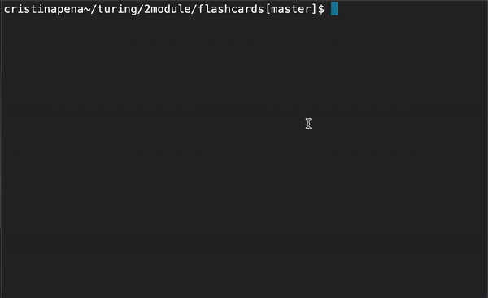

## FlashCards
#### Contributors:
* [Cristina Peña](https://github.com/CLPena)

### Project Overview:

This project is a flashcards game where the user is given a set of flashcards with questions on them. The user can select an answer and is given immediate feedback on if their answer was correct or incorrect. When the game is finished, the user will receive feedback on the total percent of questions answered correctly.

### How to Play:

To play the game, run the following code in the terminal:

```bash
node index.js
```

You will be prompted for each question, have the opportunity to select an answer, and will be given feedback. You will be able to play through the entire deck of cards:



To select an answer, you can use the arrow keys to scroll through the options. You can also type the number corresponding to your answer directly into the terminal. Hit the return key to submit your answer.

When you have answered all the questions in the deck, you will receive a message with the percentage of questions you answered correctly.

### Setup:

On the top right corner of this page, click the **Fork** button.

Clone down the forked repo (from your GitHub).

Once you have cloned the repo, change into the directory and install the library dependencies. Run:

```bash
npm install
```

To verify that it is setup correctly, run `npm test` in your terminal. You should have 5 pending tests in your `Card` test file that show up.

Running `node index.js` from the root of your project should result in the following message being displayed in your terminal:

```bash
Node server running on port 3000
```
